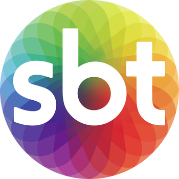

<h1 style="text-align: center; justify-content: center;">
  
  <b>sbt-videos-web-player</b>
</h1>

_SBT Videos Web Player_ é uma biblioteca privada em TypeScript para mídias adaptativas. Ela reproduz formatos de mídias adaptativas (como [DASH][] e [HLS][]) no browser, sem usar plugins ou Flash. Ao
invés, o _SBT Videos Web Player_ usa a biblioteca JavaScript de código-aberto [Shaka Player][].

Nosso principal objetivo é facilitar, na medida do possível, a transmissão de bitrate videos e audios adaptativos usando as melhores propriedade e métodos que a biblioteca [Shaka Player][] oferece.
Nos esforçamos para manter a biblioteca leve, simples e livre de outras dependencias. Tudo o que você precisa para construir seu código já está na fonte.

[shaka player]: https://shaka-player-demo.appspot.com/demo/
[dash]: https://dashif.org/
[hls]: https://developer.apple.com/streaming/

 

---

## Library support matrix

|   Library    | DASH  |  HLS  |
| :----------: | :---: | :---: |
|    React     | **Y** | **Y** |
| React Native |   -   |   -   |
|   Angular    |   -   |   -   |
|     Vue      |   -   |   -   |
|    Svelt     |   -   |   -   |

<!-- ## DASH features

## HLS features

## DRM support matrix -->

 

---

## Documentation & Important Links

- [GitHub Repository](https://github.com/sbt-lab/sbt-videos-web-player)
- [Shaka Demo](https://shaka-player-demo.appspot.com)
- [Shaka API documentation](https://shaka-player-demo.appspot.com/docs/api/index.html)
- [Shaka Tutorials](https://shaka-player-demo.appspot.com/docs/api/tutorial-welcome.html)
- Problemas e Bugs [Issues](https://github.com/sbt-lab/sbt-videos-web-player/issues)
